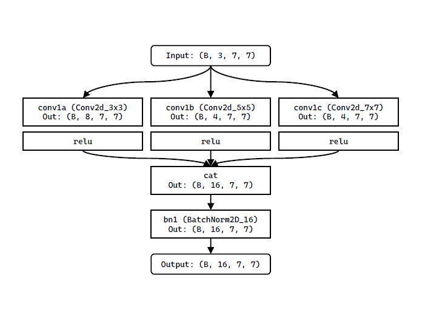
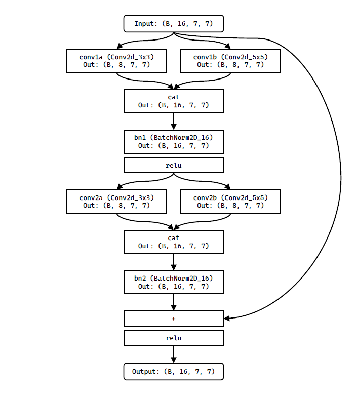
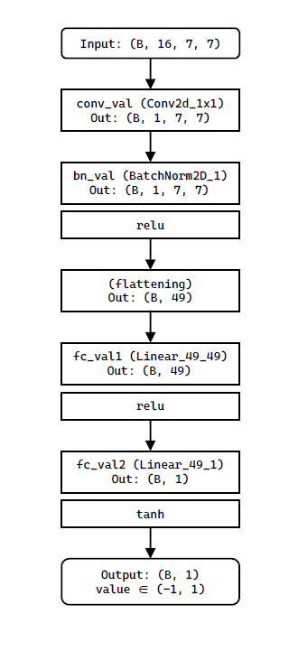
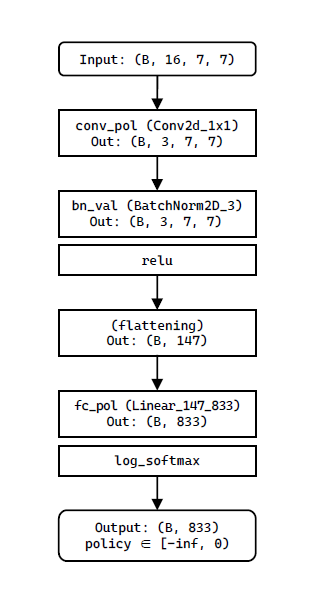

## Introduction

Alpha Zero의 알고리즘을 모방하여 제작한 Ataxx AI입니다.

2020 사이버 이공계 학생교류전(카포전/포카전)에 KAIST 선수로 출전하기 위해 제작하였습니다.

## Use

모델과 코드는 두 가지 버전이 있습니다.

- [`SidusAtaxxAI_ScienceWar_ver.zip`](./save/SidusAtaxxAI_ScienceWar_ver.zip): 2020 사이버 이공계 학생교류전에 출전한 버전
  - 모델 오류로 value head가 제대로 학습되지 않았습니다.
  - 출전 영상: https://youtu.be/czqSe_SJlb4?t=840 (Defeated, 14:00-19:20)
- [`SidusAtaxxAI_20200919_ver.zip`](./save/SidusAtaxxAI_ScienceWar_ver.zip): 모델 오류 수정, 각종 문제점 개선
- [`SidusAtaxxAI_Final_ver.zip`](./save/SidusAtaxxAI_Final_ver.zip): 알고리즘 오류 수정

윈도우 버전 Python3와 Pytorch(1.6.0)를 설치한 뒤, `ai2.py` 파일을 `ai1.py` 또는 `ai2.py`로 이름을 바꿔서, 게임 개발팀에서 제공해 준 `ataxx.exe`를 실행시키면 됩니다.

## Strategy

보통의 딥러닝 프로젝트에 비하여 실제 코드를 짤 시간과 학습을 위한 자원이 부족했기 때문에, 모델을 주의깊게 설계하고, 공개되어 있는 게임 데이터를 최대한 이용하고자 하였습니다.

## Model

### Input

Input은 3개의 layer로 구성된 `3x7x7` Tensor입니다.

- Layer 0: 현재 Player의 말 (1: 있음, 0: 없음)
- Layer 1: 상대 Player의 말 (1: 있음, 0: 없음)
- Layer 2: normalized 된 현재 turn 수로 채워진 `7x7` Tensor (0.0: 0번째 턴 ~ 1.0: 512번째 턴)

turn 수를 표시하는 레이어는, 512턴이 지나면 강제로 게임이 끝나기 때문에 필요했습니다.

다만, 모델을 만든 뒤에 현재 turn 수를 받아올 수 없다는 것을 확인해서, Self-play를 통해 학습할 때는 값을 0.5로 고정했습니다.

### Model Configuration

모델은 AlphaZero(https://arxiv.org/abs/1712.01815)의 모델을 기반으로 하고, ResNet, GoogLeNet (Inception Net)의 구성에서 아이디어를 얻었습니다.


### A convolutional layer

Ataxx의 이동 규칙은 한 번에 1칸 이동하는 것과, 한 번에 2칸 이동하는 것으로 나뉩니다. 거기에 더해 전체 맵의 상황을 따로따로 네트워크에 전달하기 위해, kernel size가 3, 5, 7인 세 개의 2D convolutional layer의 결과를 concatenate 하였습니다. 2D batch normalization과 ReLU를 함께 적용하였습니다.



### Residual Block

kernel size가 3, 5인 두 개의 2D convolutional layer를 이용하고, 마지막에 처음의 input을 더해주는 residual connection을 통해 vanishing/exploding gradient problem을 해결하고자 하였습니다.



### Value Head

Residual layers의 결과를 kernel size가 1인 2D convolutional layer에 통과시킨 뒤, 2개의 fully-connected layer를 통해 결과를 얻었습니다. `tanh`를 activation function으로 사용해서 -1부터 1 사이의 value 값을 얻었습니다.



### Policy Head

Residual layers의 결과를 kernel size가 1인 2D convolutional layer에 통과시킨 뒤, 1개의 fully-connected layer를 통해 결과를 얻었습니다. `log_softmax`를 activation function으로 사용해서 `17x7x7=833`개의 확률 분포(의 로그값)을 얻었습니다.



#### Policy Configuration Detail

Pass를 제외한 모든 가능한 move를 `17x7x7=833`가지의 값으로 표현하였습니다. (Ataxx 규칙 상 pass 여부는 플레이어가 선택할 수 없기 때문에 따로 pass에 대한 policy가 필요하지 않았습니다.)


`x`, `y`는 Player의 말이 움직인 좌표입니다.

`d`는 움직이기 전 말의 위치에 따라 다음과 같이 0~16의 값을 가집니다. (`*`가 `(x, y)`에 해당하는 위치) 한 칸 움직였을 경우는 말의 출처를 따질 필요가 없기 때문에, `d`값은 모두 0으로 동일하게 놓았습니다.

```reStructuredText
y increasing
^
3  2  1  16 15
4  0  0  0  14
5  0  *  0  13
6  0  0  0  12
7  8  9  10 11 => x increasing
```

즉, `(3, 4)`에 있던 말이 `x` 방향으로 2, `y` 방향으로 -1 이동한다면, `d=12`이고 좌표는 `(x, y)=(5, 3)`이 되므로 이 move에 해당하는 값은 이 됩니다.

## Train

ataxx.org에서 받아온 PGN 기보 데이터를 통한 training과, self-play를 통한 training 두 가지를 주로 사용하였습니다. 거기에 경기에서 AI의 승률을 더 높이기 위해 minimax AI와의 경기 결과를 부가적으로 사용하였습니다. 학습된 신경망은 현재 `champ`인 신경망과 경기해, 일정 승수를 따내면 새로운 `champ`가 되도록 하였습니다.

학습에는 Intel(R) Core(TM) i5-6300HQ, NVIDIA GeForce GTX 950M을 사용했습니다. = 제 노트북을 사용했습니다.

- `SidusAtaxxAI_ScienceWar_ver.zip`: Existing dataset ~24h training, Self-play ~4h training
  - 모델 오류로 value head가 학습되지 않았습니다.
- `SidusAtaxxAI_20200919_ver.zip`: Existing dataset ~24h training (only policy is trained), Self-play ~72h training
- `SidusAtaxxAI_Final_ver.zip`: Existing dataset ~24h training (only policy is trained), Self-play ~96h training

### Existing Dataset

`requests`, `bs4`를 이용하여, [server.ataxx.org](https://server.ataxx.org)에 공개되어 있는 AI끼리의 경기 기보를 전부 다운로드하였습니다([crawl.py](./crawl.py) 참고). [`Python-ataxx`](https://github.com/kz04px/python-ataxx)를 통해 PGN을 게임 board로 parsing하고, 각 Player의 다음 수(policy)와 전체 경기 결과(value)를 예측하도록 train 하였습니다.

- Notes: 해당 경기 규칙은 각 AI가 50번 수를 놓고 나서 경기가 끝나지 않았으면 무승부로 처리합니다. 이는 교류전 규칙과 다른 부분이었습니다. 다만 이 데이터는 학습 초반에만 이용하였기 때문에 그 부분은 무시하였습니다.

해당 코드는 [train.ipynb](./train.ipynb)에서 볼 수 있습니다.

### Self-play

그 뒤, 아래에 나올 [Algorithm](./README.md#Algorithm)대로 AI 스스로와 경기를 진행해, 지난 경기의 모든 상태를 데이터셋으로 이용하여 학습하였습니다([train_against.py](./train_against.py) 참고).

저장된 데이터셋의 수가 100,000개를 넘으면, 랜덤으로 100,000개만 남긴 뒤 최신 경기 결과를 포함하여 새로운 데이터셋으로 사용하였습니다.

학습을 빠르게 하기 위하여, 최대 턴 수를 제한하였습니다. 제대로 학습한다면 턴 수가 100을 넘어갈 가능성이 낮기 때문입니다.

#### Play against Minimax Algorithm

`Python-ataxx`에 구현된 Minimax algorithm(Alpha-beta pruning 적용)과 모의경기를 진행했을 때, 승률이 매우 낮은 문제가 있었습니다. 실제 경기에도 Minimax를 이용한 알고리즘이 다수 나올 거라고 생각해서, 이를 극복하기 위해 학습 전에 Self-play를 할지 Minimax algorithm과 경기를 할지 선택할 수 있도록 하였습니다.

### Deciding Best Player

학습된 신경망은 현재 `champ`인 신경망과 경기해, 7 경기 중 5 경기를 승리하면 새로운 `champ`가 되도록 하였습니다.

통계적으로 유효하게 강하다고 보기에 어려운 비율이지만, 가지고 있는 컴퓨팅 파워로 한 경기를 simulation하는 것이 너무 오래 걸렸기 때문에 불가피하였습니다.

## Algorithm

Alpha Zero의 MCTS 알고리즘을 그대로 이용하였습니다.

Train&evaluate 중에는 정해진 depth만큼 탐색하였고, 실전에서는 실행된 지 약 8s가 지났으면 탐색을 중단하도록 하였습니다.(경기 규칙은 10s timeout)

`SidusAtaxxAI_ScienceWar_ver.zip`에서는 value가 제대로 학습되지 않은 문제가 있었기에, 신경망에서 얻은 value와 (점수차/49)의 평균값을 임시방편으로 value로서 사용하였습니다.

## Improvements

- MCTS에 게임의 대칭성을 사용할 수 있었으나, 구현하지 못했습니다. (상하좌우 대칭, 회전대칭, 플레이어 반전)

- 모든 move 가능성을 독립적으로 표현하려다 보니 policy 표현이 실질적으로 필요한 것보다 복잡해졌습니다.

- 그러다 보니 policy head 쪽의 network가 더 복잡해져야 할 필요가 있었는데, 그에 비해 현재의 model은 parameter가 부족할 듯합니다.

## TODO

Modify code to match https://ataxx.org UAI specification

Calculate Elo rating

Share final version

## Contact

질문이나 요청사항은 issue나 메일(mingi.shin@kaist.ac.kr), 트위터 계정([@yuagnun](https://twitter.com/yuagnun))으로 편하게 보내주세요.
